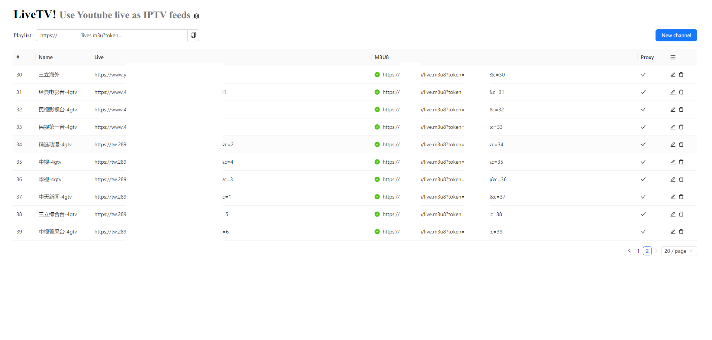

# LiveTV

Aggregate IPTV feeds in one station and enjoy!

## Install 

A custom compiling is required. Docker image is not available yet.

```bash
git clone https://github.com/snowie2000/livetv
cd livetv
go build
```

## Usage

Default password is "password".

First you need to know how to access your host from the outside, if you are using a VPS or a dedicated server, you can visit `http://your_ip:9500` and you should see the following screen.



First of all, you need to click the gear button and "Auto Fill" in the setting area, set the correct URL, then click "Ok".

Then you can add a channel. After the channel is added successfully, you can play the M3U8 file from the address column.

When you use Kodi or similar player, you can consider using the M3U file URL in the playlist field, and a playlist containing all the channel information will be generated automatically.

To protect your service from unauthorized access, you can set a secret in the settings dialog and then all your playlist and proxy services will need a unique token to access (based on your secret).
