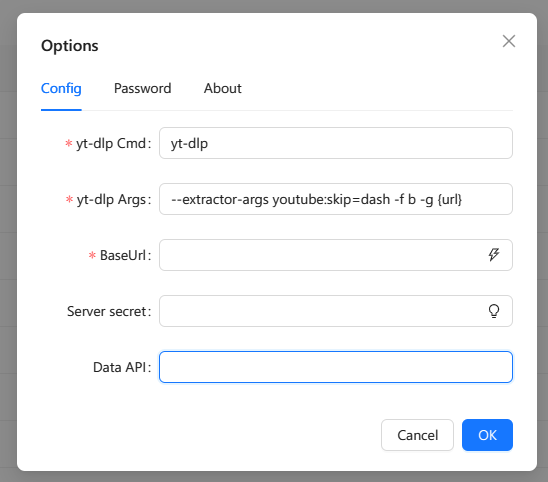

# 保护服务器

初始话安装的livetv虽然有默认密码保护，但生成的播放地址都是固定格式的，只要别人知道你的域名就可以直接通过以下地址：`https://你的域名/lives.m3u?token=` 来直接访问您的播放列表，因此如果您不想公开您的播放列表，您可以设置secret来保护您的服务器。

在此之前，您需要先初始化baseurl，即livetv所在的服务器地址。

## 设置baseurl

点击控制台LiveTV标题右侧的齿轮图标，进入设置页面。

找到Baseurl，在输入框中输入可以在外部访问您服务器的地址。通常您只需要点击右侧的⚡图标，即可自动填写。如果自动填写的不正确，请手动输入正确的地址。

该设置将影响livetv生成的所有播放列表中的信息，如果设置不正确，所有的视频源都将无法播放。

## 设置secret
在设置页面的 `server secret` 输入任意文字作为您的secret，您也可以点击右侧的⚡图标来自动生成一个随机的secret。这样您的livetv将会通过这个secret来生成独一无二的播放地址，只有知道播放地址的人才能观看您的视频。

**如果在流代理一章中使用Custom自定义服务器来代理视频流，则所有服务器的secret必须相同，否则将无法正常播放。**

## 修改密码
在安装livetv后，您应该尽快修改默认密码。在设置页面的 `password` 输入您的新密码，然后点击Ok保存

## 关于 yt-dlp
设置界面中已经内置了yt-dlp的默认调用参数，如果您有自己的偏好设定，您可以在此修改。