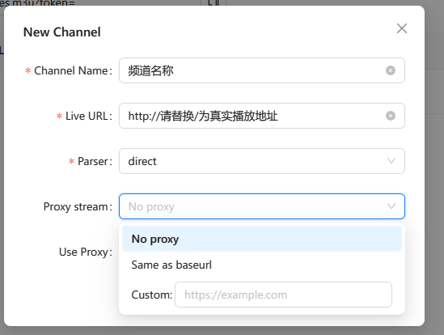

# 流代理

在部分特殊情况下，我们需要对视频流进行代理，包含但不限于：
- 视频仅能在指定地区播放
- 视频仅能使用指定的运营商播放，如移动专用源
- 视频有ip限制或封锁，必须使用云服务访问
- 视频流存在防盗链，需要特定的header请求头或cookie等
- 视频流仅能使用ipv6播放，但是您的设备只支持ipv4

在这些情况下，我们可以使用流代理来解决问题。

## 启用流代理
在下图的对话框中，点击`Proxy Stream`下拉框，您可以看到以下选项：
- No proxy: 默认值，不代理流
- Same as baseurl：使用livetv所在的服务器代理流（通常使用这项）
- Custom：使用安装在其他地址上的livetv服务器代理流

下面我们将解释这三个选项的区别。
### No proxy
该选项为默认值。

在此状态下，livetv生成的播放列表将直接指向视频的真实地址，您的播放器将直接从视频源获取视频流。适用于视频源没有任何限制的情况，或您的播放环境本身符合限制不需要任何代理的情况。

此模式下，livetv只代理播放列表，几乎不消耗流量，没有并发压力，可以任意多设备同时访问也不会有压力。

### Same as baseurl
该选项将使用livetv所在的服务器代理流。

例如您有一个移动的服务器，在上面安装了livetv，那么您可以使用这个选项，livetv生成的播放列表将自动修改，您可以在任何网络都正常观看移动专用源。

**注意：此模式下观看视频将消耗服务器流量，请注意流量使用！**

### Custom
该选项将使用您指定的服务器代理流。

您可以设置一个其他服务器的地址，livetv将生成的播放列表指向这个地址代理。

该选项用于您有多台服务器，不同服务器拥有不同的特性以解锁对应的视频源。

例如您有一台香港服务器用于观看香港视频，一台美国服务器用于观看美国专属视频等，那么您可以使用对应的服务器进行代理，就可以通过livetv统一管理并观看来自全世界的直播了。

要使用此选择，您需要在所有的服务器上都安装livetv并设置相同的secret，然后在Proxy stream中选择custom并输入对应的地址即可。

----

下一章：[代理](Proxy_cn.md)