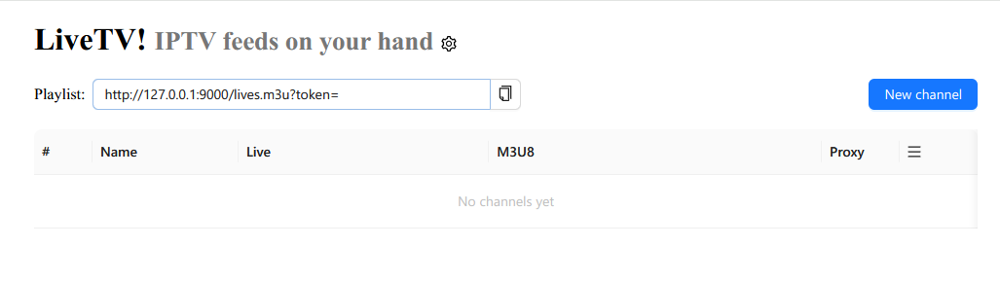
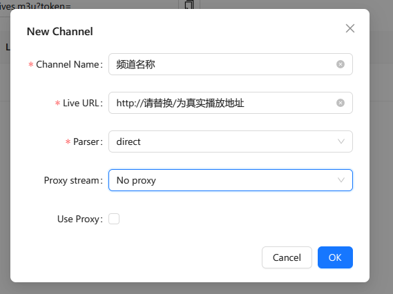

# 开始使用

现在您的livetv已经成功运行。在接下来的说明中，我们假设您的livetv运行在端口9000上，并使用了域名 example.com，那么现在您可以通过 http://example.com:9000 来访问控制台了。
我们建议您启用https连接，以保证数据传输的安全性。您可以通过使用nginx反向代理来实现https连接。

## 登录
访问 http://example.com:9000 后，您将看到一个登录页面。
如果您是部署在本机，您也可以直接访问 http://127.0.0.1:9000 来登录。
第一次访问控制台时，您需要输入密码。默认密码为password。您可以在控制台中修改密码。

## 添加源
在登录后，您将看到一个空白的控制台。首先您需要添加一个源。

点击图中右上角的“New Channel”按钮来添加一个源。您会看到如下图的对话框：

在此对话框中，频道名称可以任意输入。频道URL输入您的播放源的地址。
例如您有一个php解析了m3u8的地址：http://example.com/live.php?channel=xxx ，那么您可以输入这个地址。

在下面的parser中，您需要根据您的源的返回的类型选择一个解析器。

在下一章中，我们将详细解释如何选择解析器

## 观看
在添加源成功后，您可以在表格的M3U8列看到一个新的播放地址，您可以通过这个地址来观看您的频道。

您也可以在标题栏下面的Playlist中看到一个不会变化的m3u地址，这个地址包含了您所有的直播列表，并会随着新的源的加入自动更新，您可以将此地址输入到支持m3u的播放器。

您也可以通过m3u转txt的工具将其转换成tvbox可以播放的格式来观看直播。

----

下一章：[解析器](Parser_cn.md)
